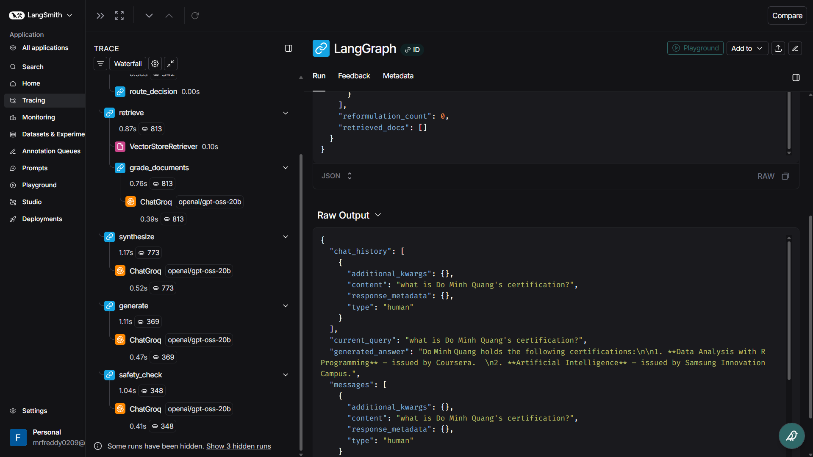
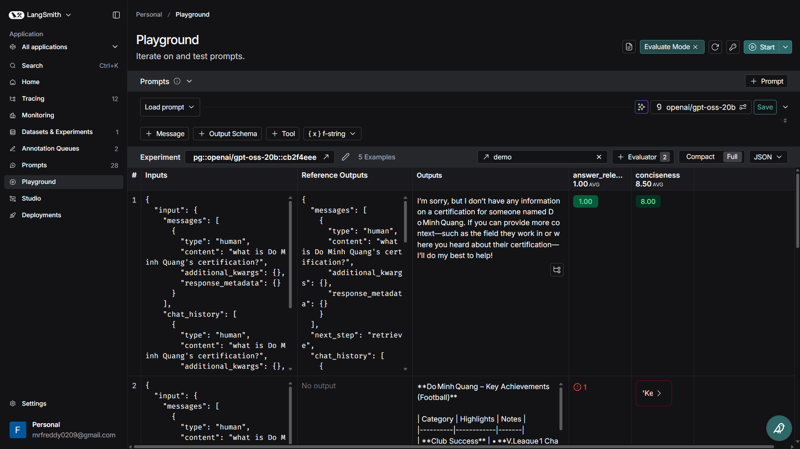

# Agentic RAG System

Intelligent RAG system using multi-agent architecture with LangGraph and Streamlit.


## Features

- Multi-agent routing: Automatically selects best retrieval method
- Query reformulation: Improves questions for better results
- Web search fallback: Searches web when documents are insufficient
- Document grading: Evaluates document relevance
- Safety check: Ensures safe content
- Multiple sources: Supports URLs, TXT, PDF, DOCX

## Installation

1. Create `.env` file:
```
GROQ_API_KEY=your_key
TAVILY_API_KEY=your_key
LANGSMITH_API_KEY=your_key
```

2. Install dependencies:
```bash
pip install -r requirements.txt
```

3. Run:
```bash
streamlit run app.py
```

## Usage

1. Add URLs or upload files in sidebar
2. Click "Apply Parameters & Update Knowledge"
3. Ask questions and get answers

## Project Structure

- `app.py`: Main app (modular structure)
- `main.py`: Main app (single file)
- `agents.py`: Agent functions
- `decisions.py`: Routing logic
- `state.py`: State management
- `config.py`: Configuration
- `utils.py`: Utility functions

## Technologies

- LangGraph: Multi-agent orchestration
- Streamlit: UI
- Groq: LLM
- HuggingFace: Embeddings
- ChromaDB: Vector store
- Tavily: Web search

## Tracing using LangSmith


## LLM-as-a-Judge evaluator using LangSmith



